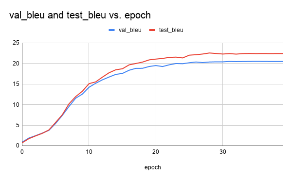

## Description
This benchmarks GNMT under MXNet. The benchmark source is adopted from [gluon-nlp.mxnet.io](https://gluon-nlp.mxnet.io/master/examples/machine_translation/gnmt.html).

The benchmark is performed using the following software environments CUDA version: 10.1 CUDNN version: 7.6 Ubuntu version: 18.04.

## 1 Setup
### 1.1 Getting Docker
This benchmark requires Docker. To do so, follow the steps [here](https://docs.docker.com/engine/install/).

### 1.2 Running the container
First, build the container with 
```
build_image.sh
```
This only has to be done once.

Then, start the container by with
```
run_container.sh
```
A shell inside the container will be spawned at the location `/scripts`. This directory contains the necessary scripts to perform training or benchmarking.

#### 1.3 Obtaining Dataset
The dataset will be automatically downloaded to `/scratch` when training.

## 2 Training
Inside the scripts folder, run:
```
bash train.sh
```
Below is a training curve obtained from our run (English-Vietnamese)


## 3 Benchmarking
### 3.1 GPU Compute Utilization
Inside the scripts folder, run
```
bash profile.sh nvvp
```
to profile GPU compute utilization.

The measurements will be in `/scratch/measurements/profile_(time)_bs(batch_size).nvvp`. You will find `nvvp` files with sizes larger than 100MB.

To parse and compute the results, use the NVidia Visual Profiler.

### 3.2 GPU Core Utilization
Inside the scripts folder, run
```
bash profile.sh nsight
```
to profile GPU core utilization.

The benchmarking results will be located inside `scratch/measurements` folder. The log files will be a few MBs in size.

To parse the results, use the [nsight log parser](https://github.com/UofT-EcoSystem/DNN-Training-Suite/tree/ybgao-temp/Core-Utilization-Analyzer).

