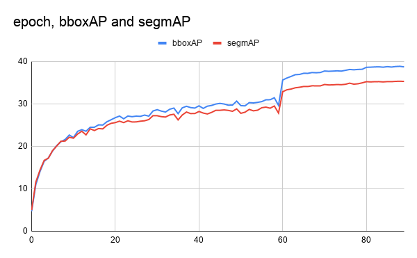

## Description
This benchmark is for MaskRCNN under PyTorch. The benchmark source is adopted from [facebookresearch/detectron2](https://github.com/facebookresearch/detectron2).

The benchmark is performed using the following software environments CUDA version: 10.1 CUDNN version: 7.6 Ubuntu version: 18.04.

## 1 Setup
### 1.1 Getting Docker
This benchmark requires Docker. To do so, follow the steps [here](https://docs.docker.com/engine/install/).

### 1.2 Running the container
First, build the container with 
```
bash build_image.sh
```
This only has to be done once.

Then, start the container by with
```
bash run_container.sh
```
A shell inside the container will be spawned at the location `/scripts`. This directory contains the necessary scripts to perform training or benchmarking.

After starting the container, we install additional dependencies by running:
```
bash setup.sh
```

## 2 Dataset
Download the COCO 2017 train+val+annotations images from:
* train2017: [http://images.cocodataset.org/zips/train2017.zip](http://images.cocodataset.org/zips/train2017.zip)
* val2017: [http://images.cocodataset.org/zips/val2017.zip](http://images.cocodataset.org/zips/val2017.zip)
* annotations: [http://images.cocodataset.org/annotations/annotations_trainval2017.zip](http://images.cocodataset.org/annotations/annotations_trainval2017.zip)

Then extract them into `/dataset` with the following structure.

```
/dataset
  |-- annotations
  |-- train2017
  `-- val2017
```

## 3 Training
To train the model with the COCO dataset, run
```
bash switch.sh noprofile
bash train.sh
```

The following training curve is obtained from our run.



## 4 Benchmarking
Before beginning benchmarking, first create the folder in which benchmarking results are stored:
```
mkdir /scratch/measurements
```

### 4.1 GPU Compute Utilization
Inside the scripts folder, run
```
bash switch.sh nvprof
bash profile.sh nvprof
```
to profile GPU compute utilization.

NVProf will output its profiling results in `scratch/measurements`. You will find `nvvp` files with sizes larger than 100MB.

To parse and compute the results, use the NVidia Visual Profiler.


### 4.2 GPU Core Utilization
Inside the scripts folder, run
```
bash switch.sh nsight
bash profile.sh nsight
```
to profile GPU core utilization.
The benchmarking results will be located inside `scratch/measurements` folder. The log files will be a few MBs in size.

To parse the results, use the [nsight log parser](https://github.com/UofT-EcoSystem/DNN-Training-Suite/tree/ybgao-temp/Core-Utilization-Analyzer).

### 4.3 GPU Core Utilization
Inside the scripts folder, run
```
bash switch.sh memory
bash run.sh
```
to profile memory usage.

Memory utilization CSV will be written to `/scratch/measurements/memory_csv_data`.
