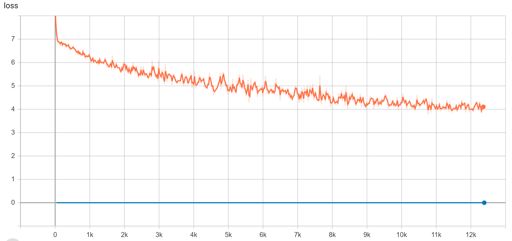

## Description
This benchmarks Minigo under TensorFlow. The benchmark source is adopted from [tensorflow](https://github.com/tensorflow/minigo).

The benchmark is performed using the following software environments CUDA version: 10.0 CUDNN version: 7.6 Ubuntu version: 18.04.

## 1 Setup
### 1.1 Getting Docker
This benchmark requires Docker. To do so, follow the steps [here](https://docs.docker.com/engine/install/).

### 1.2 Running the container
First, Build the container with 
```
bash build_image.sh
```

Then, start the container by with
```
bash run_container.sh
```
A shell inside the container will be spawned at the location `/scripts`.

## 2 Dataset
No datasets required for minigo.

## 3 Training
Inside the scripts folder, run
```
bash train.sh
```
Below is a training curve obtained from our run.



## 4 Benchmarking
### 4.1 GPU Compute Utilization
Inside the scripts folder, run
```
bash run_profile.sh nvvp
```
to profile GPU compute utilization.

The results will be stored in `/scratch/measurements`. The filenames will follow the format of `profile_<timestamp>_bs<batch_size>.nvvp` with sizes lower than 100MB. 
These results can be viewed with the Nvidia Visual Profiler

### 4.2 GPU Core Utilization
Inside the scripts folder, run
```
bash run_profile.sh nsight
```
to profile GPU core utilization.

The results will be stored in `/scratch/measurements`. The filenames will follow the format of `nsight_bs<batch_size>.csv` with sizes a few MB. To parse the results, use the [nsight log parser](/Core-Utilization-Analyzer).
