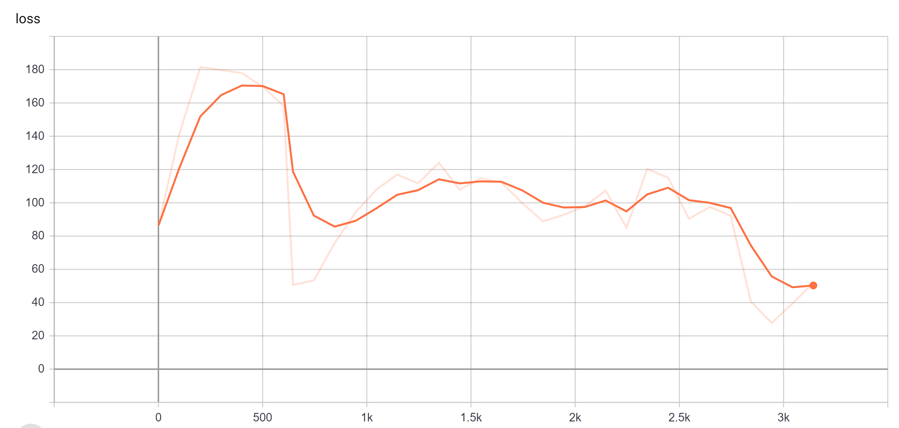

## Description
This benchmark is for DeepSpeech2 under Tensorflow. The benchmark source is adopted from [tensorflow/deep_speech](https://github.com/tensorflow/models/tree/master/research/deep_speech).

The benchmark is performed using the following software environments CUDA version: 10.0 CUDNN version: 7.6 Ubuntu version: 18.04.

## 1 Setup
### 1.1 Getting Docker
This benchmark requires Docker. To do so, follow the steps [here](https://docs.docker.com/engine/install/).

### 1.2 Running the container
First build the container with 
```
bash build_image.sh
```

Then, start the container by with
```
bash run_container.sh
```
A shell inside the container will be spawned at the location `/scripts`. This directory contains the necessary scripts to perform training or benchmarking.


## 2 Dataset
The OpenSLR LibriSpeech Corpus are used for model training and evaluation.

The training data is a combination of train-clean-100 and train-clean-360 (~130k examples in total). The validation set is dev-clean which has 2.7K lines. 
The download script under `/scripts/data_downloader` will preprocess the data into three columns: wav_filename, wav_filesize, transcript. data/dataset.py will parse the csv file and build a tf.data.Dataset object to feed data. 
Within each epoch (except for the first if sortagrad is enabled), the training data will be shuffled batch-wise.

## 3 Training
To train the model, run
```
bash run_deep_speech.sh
```

The following training curve is obtained from our run.




## 4 Benchmarking
### 4.1 GPU Compute Utilization
Inside the scripts folder, run
```
bash run_nvprof.sh
```
to profile GPU compute utilization.

The results will be stored in `/scratch/measurements`. The filenames will follow the pattern of `profile_<timestamp>_bs_<batch_size>.nvvp`. These results can be viewed with the Nvidia Visual Profiler. 

### 4.2 GPU Core Utilization
Inside the scripts folder, run
```
bash run_nsight.sh
```
to profile GPU core utilization.

The results will be stored in `/scratch/measurements`. The filenames will follow the pattern of `nsight_bs_<batch_size>.csv`. To parse the results, use the [nsight log parser](/Core-Utilization-Analyzer).

